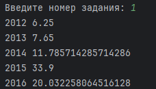
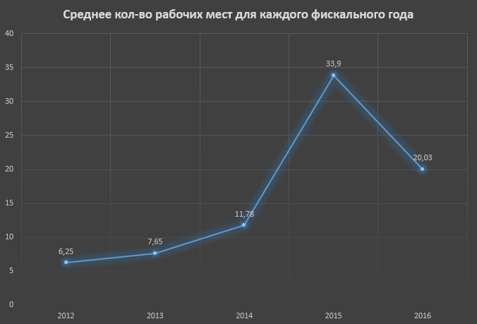
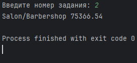
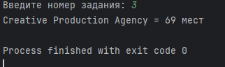
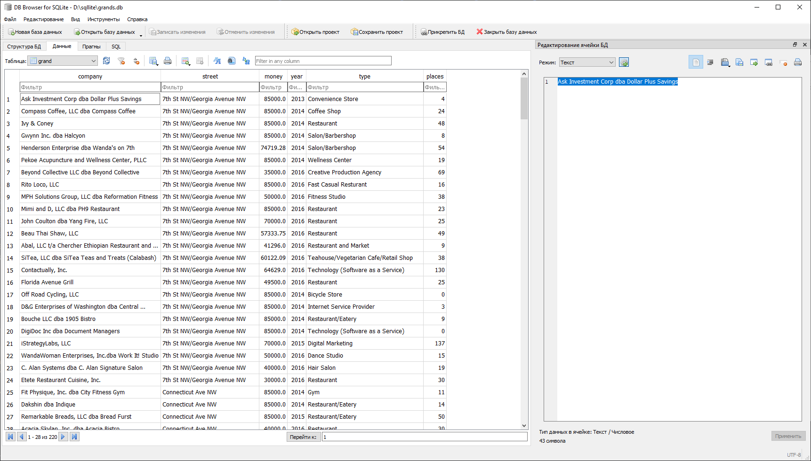

Студент - Богорад Вера Сергеевна
<h2>CsvReader.class</h2>
Класс для парсинга csv-файла, где каждого строка помещается в объект класса Grand для дальней отправки в базу данных.

<h2>Grand.class</h2>
Класс для полей csv-файла, где у каждого названия столбца есть своя переменная.
Также прописаны Getter и Setter.

<h2>Conn.class</h2>
Класс для подключения к базе данных и выполнений заданий.
Тут находятся методы для создания, удаления таблицы, а также добавлений значений в таблицу.

<h2>Tasks.class</h2>
Класс для запуска методов для получения ответов на 1-3 задания.

<h2>Последовательность работы с кодом</h2>

1. Запускаем класс CsvReader для создания и добавления значений в бд.
2. Запускаем класс Tasks и в консоле вводим номер задания, ответ которого нам нужен.

<h2>Ответы на задания, а также их решение</h2>
<h3>Задание 1</h3>
1. Отпраляем запрос "SELECT year,places FROM grand" для получения значений стобцов "Фискальный год" и "Количество рабочих мест".
2. Создаём массивы для хранения суммы грандов для каждого года, а также кол-во "совпадений" годов.
3. Используем цикл для прохода по полям запроса.
4. Для каждого года складываем сумму в соответсвующую ичейку массива.
5. Делим сумму на кол-во "совпадений" для каждого года.
6. Выводим ответ.
7. Используя данные, составляем график в Excel.

<h3>Задание 2</h3>
1. Отпраляем запрос "SELECT money,type FROM grand WHERE type = "Salon/Barbershop"" для получения значений стобцов "Размер гранта" и "Тип бизнеса", где "Тип бизнеса" = "Salon/Barbershop".
2. Для нахождения среднего гранда в данном типе бизнеса, мы создаём две переменные: для суммирования гранта и для подсчитывания кол-ва грантов.
3. При помощи цикла всё суммируем и считаем.
4. Выводим ответ.

<h3>Задание 3</h3>
1. Отпраляем запрос "SELECT type,places,money FROM grand ORDER BY places DESC" для получения значений стобцов "Размер гранта","Тип бизнеса" и "Количество рабочих мест", сортируя по уменьшению по столбцу "Количество рабочих мест".
2. Дальше логика такая: нам нужно, чтобы "Размер гранта" был меньше 55000 и с самым большим "Количество рабочих мест", и если мы уже отсортировали по уменьшению мест, то отстаётся только найти первую строке, где "Размер гранта" < 55000, что мы и делаем через оператор if.
3. Выводим ответ.

<h2>База данных</h2>

